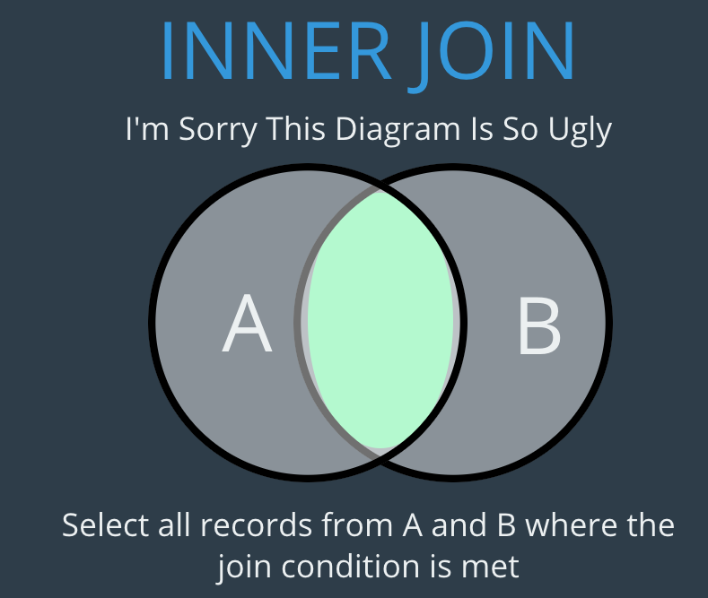
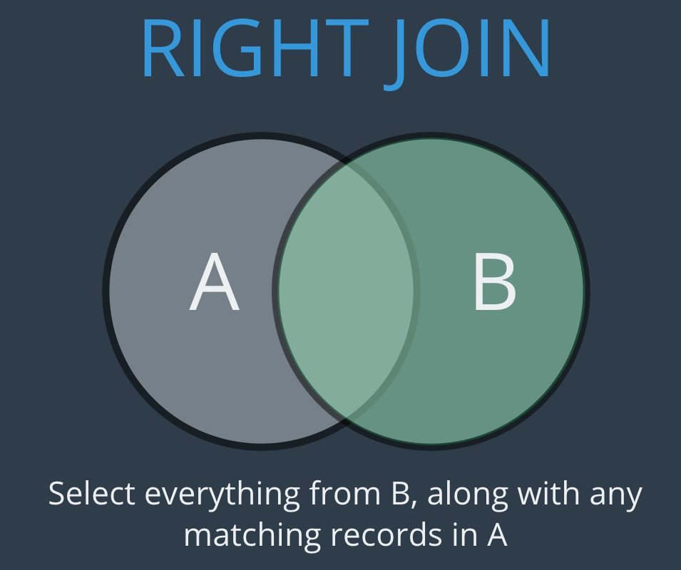
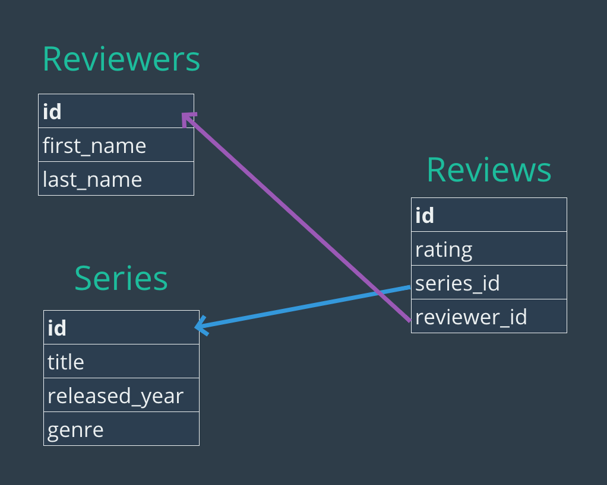

## Relationships

## One To Many

https://www.udemy.com/the-ultimate-mysql-bootcamp-go-from-sql-beginner-to-expert/learn/v4/t/lecture/7031026?start=0


## INNER JOIN

Get all order from the customer with `last_name` 'George' (long version)
```sql
SELECT * FROM orders 
WHERE customer_id =
      (
        SELECT customer_id FROM customers WHERE last_name = 'George'
      );
```

Cross Join Craziness Get all order multiplied by each user. This is utterly useless.
```
SELECT * FROM customers, orders;
```



IMPLICIT INNER JOIN
```sql
SELECT first_name, last_name, order_date
FROM customers, orders 
WHERE customers.id = orders.customer_id;
```

There is a better way of doing this using an explicit syntax

EXPLICIT INNER JOIN
```sql
SELECT first_name, last_name, order_date FROM customers
JOIN orders on customers.id = orders.customer_id;
```

All regular operations is still available on the joined table as shown by this example:
```sql
SELECT first_name, last_name, order_date, SUM(amount) as total_spent
FROM customers JOIN orders on customers.id = orders.customer_id 
GROUP BY orders.customer_id
ORDER BY total_spent;
```

## LEFT JOIN


Does the same as a `INNER JOIN` but includes all customers even though they are not referenced in
the `orders` table. Intersection + Left side. 

This is useful I.E when you want to see both high spenders and the people that did not buy at all.

```sql
SELECT * FROM customers
LEFT JOIN orders 
  ON customers.id = orders.customer_id;
```

Sum all spending for each customer showing customers with no spending.
```sql
SELECT first_name, last_name, SUM(amount) as total_spent
FROM customers 
LEFT JOIN orders 
  ON customers.id = orders.customer_id 
GROUP BY customers.id
```
Results in:
```
+------------+-----------+-------------+
| first_name | last_name | total_spent |
+------------+-----------+-------------+
| Boy        | George    |      135.49 |
| George     | Michael   |      813.17 |
| David      | Bowie     |        NULL |
| Blue       | Steele    |        NULL |
| Bette      | Davis     |      450.25 |
+------------+-----------+-------------+
```
It would be nice to replace `NULL` with zero which is more appropriate for numbers. How do we do
that? `IFNULL` is the nifty solution

```sql
SELECT first_name, last_name, IFNULL(SUM(amount), 0) as total_spent
FROM customers 
LEFT JOIN orders 
  ON customers.id = orders.customer_id 
GROUP BY customers.id
ORDER BY total_spent;
```

Results in:
```
+------------+-----------+-------------+
| first_name | last_name | total_spent |
+------------+-----------+-------------+
| Boy        | George    |      135.49 |
| George     | Michael   |      813.17 |
| David      | Bowie     |        0.00 |
| Blue       | Steele    |        0.00 |
| Bette      | Davis     |      450.25 |
+------------+-----------+-------------+
```

## RIGHT JOIN



[The Ultimate MySQL bootcamp - Right Joins Part 2](https://www.udemy.com/the-ultimate-mysql-bootcamp-go-from-sql-beginner-to-expert/learn/v4/t/lecture/7031136?start=0)

```sql
SELECT * FROM customers 
RIGHT JOIN orders ON customers.id = orders.customer_id;
```

It is important to note that
```sql
SELECT * FROM customers
LEFT JOIN orders 
  ON customers.id = orders.customer_id;
```
Is the same as
```sql
SELECT * FROM orders
LEFT JOIN customers
  ON customers.id = orders.customer_id;
```
The only difference will be the order of the columns in the result 


## On Delete Cascade
By defining `ON DELETE CASCADE` in the `FOREIGN KEY` declaration all occurrences of a
child will be removed when it's parent is removed.

```
FOREIGN KEY (customer_id) 
  REFERENCES customers (id) 
  ON DELETE CASCADE
```

This will not only delete the customer Boy George but also his orders.
```sql
DELETE from customers WHERE email='george@gmail.com';
```

## Many to Many

https://www.udemy.com/the-ultimate-mysql-bootcamp-go-from-sql-beginner-to-expert/learn/v4/t/lecture/7048208?start=0


[The Ultimate MySQL bootcamp - Many To Many](https://www.udemy.com/the-ultimate-mysql-bootcamp-go-from-sql-beginner-to-expert/learn/v4/t/lecture/7048208?start=0)

Get the review for all series
```sql
SELECT title, rating 
FROM series 
JOIN reviews ON series.id = reviews.series_id;
```


Get the average rating for all series group by series id
```sql
SELECT title, AVG(rating) as average_rating 
FROM series 
JOIN reviews ON series.id = reviews.series_id
GROUP BY series.id
ORDER BY average_rating;
```

Get the rating and reviewers firstname and lastname for every review 
```sql
SELECT first_name, last_name, rating
from reviewers
JOIN reviews on reviewers.id = reviews.reviewer_id
```

Get all series that are not reviewed (using a LEFT JOIN)
```sql
SELECT title as unreviewed_series FROM series
LEFT JOIN reviews 
  ON series.id = reviews.series_id
WHERE reviews.id IS NULL;

```

Get average rating per genre rounded to two digits
```sql
SELECT genre, ROUND(AVG(rating),2) as avg_rating FROM series
JOIN reviews ON series.id = reviews.series_id 
GROUP BY genre;
```

Get statistics for our reviewers
```sql
SELECT 
       first_name, 
       last_name, 
       IFNULL(COUNT(rating), 0) as COUNT, 
       IFNULL(MIN(rating), 0) as MIN, 
       IFNULL(MAX(rating), 0) as MAX, 
       ROUND(IFNULL(AVG(rating), 0),2) as AVG,   
       IF (COUNT(rating) = 0, 'INACTIVE', 'ACTIVE ') as status
FROM reviewers
LEFT JOIN reviews ON reviewers.id = reviews.reviewer_id
GROUP BY reviewers.id;
```

Get all reviews with reviewers and series name (Many To Many)
```sql
SELECT title, rating, CONCAT(first_name, last_name) as name 
FROM reviewers
JOIN reviews ON reviewers.id = reviews.reviewer_id
JOIN series ON series.id = reviews.series_id
ORDER BY title;
```

